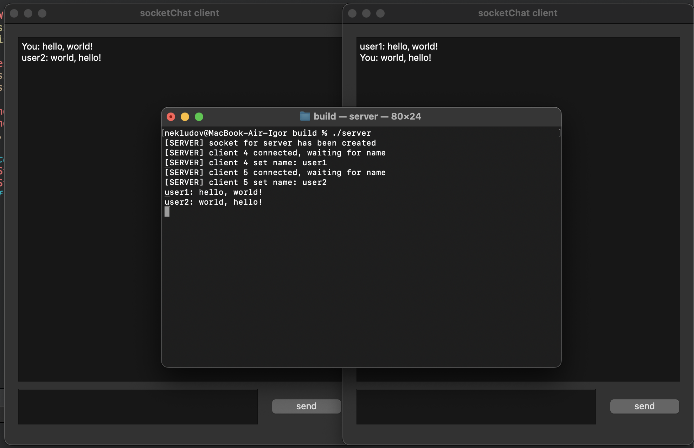

# socketChat

A simple GUI client-server chat application built with C++ and Qt. The server handles multiple streaming client connections, enabling real-time messaging between users.

> **Note:** Developed as a coursework project on the topic "Development of Network Applications in C++".



---

## Contents

* [Features](#features)
* [Implementation Details](#implementation-details)
* [Requirements](#requirements)
* [Build & Install](#build--install)
* [Usage](#usage)
* [TODO](#todo)

---

## Features

* **Real-time Messaging:** Users can exchange messages in a common chat room.
* **Multi-client Support:** Server handles multiple concurrent connections using I/O multiplexing.
* **GUI Client:** User-friendly interface built with Qt.
* **User Identification:** Users identify themselves by name upon connection.
* **Error Handling:** Basic detection of connection failures and disconnections.

---

## Implementation Details

* **Server:** Implements a TCP server using POSIX sockets (`sys/socket.h`). It uses `select()` to handle multiple file descriptors simultaneously, storing active user sessions in a `std::map`.
* **Client:** The client application uses the Qt framework for the graphical interface and `std::thread` for handling network communication on a separate thread.

---

## Requirements

* **C++20**
* **Qt 6.8.1**
* **CMake 3.29**

---

## Build & Install

1. Clone the repository:

```bash
git clone https://github.com/neklyudovv/socketChat.git
```

2. Build the Server:

```bash
cd socketChat
mkdir build && cd build
cmake ..
make
```

3. Build the Client:

```bash
cd ../client
mkdir build && cd build
cmake ..
make
```

---

## Usage

### Server:

From the `socketChat/build` directory:
```bash
./server
```
The server will start listening for incoming connections on port 8080 (all interfaces).

### Client:

From the `socketChat/client/build` directory:
```bash
open ./client.app
```
*On Linux/Windows, run the executable directly (e.g., `./client`).*

Upon launch, enter your username to connect to the server. Incoming and outgoing messages will appear in the main chat window.

---

## TODO

* [ ] Server address/port configuration UI
* [ ] Message history limit/storage
* [ ] UI enhancements (themes, sound notifications)
* [ ] "Send" on Enter key press
